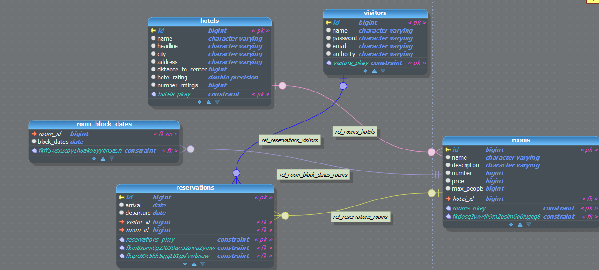

<h1 align="center">HotelLand</h1>
<h3 align="center">Содержание:</h3>
1. Описание приложения и функционала 
2. Запускаем приложение 
3. API взаимодействие с приложением 
4. Схема структуры базы данных
5. Использованные технологии и их версии

____
### I. Описание приложения и функционала

Перед вами сервис бронирования отелей, который поможет успешно бронировать номера в выбранном отеле.
Кроме базового функционала приложения по принципу получения данных, создания, обновления,
и удаления всех доступных моделей приложения: посетителя, отеля, комнаты, бронирования,
в приложении предоставлен весьма удобный и практичный на сегодня функционал.

В первую очередь, приложение предлагает удобную систему аутентификации по логину и паролю, 
при которой доступ к приложению осуществляется ограничено пользователю с ролью USER и полный доступ ко всем возможностям с ролью ADMIN.
Роль пользователя задается при регистрации в параметре запроса. 
Остальные параметры пользователя при регистрации передаются в теле запроса. 
После регистрации в базе данных создается запись с данными пользователя.
И при последующем использовании приложения пользователю нужно будет лишь вписать свои логин 
и пароль и если они валидны, то ему будет доступна выбранная опция.

После регистрации и аутентификации, пользователю будет доступен основной функционал приложения и
конечно самое главное это возможно забронировать конкретно выбранный номер на конкретный промежуток времени. 
Для этого пользователю достаточно внести необходимые данные из которых самые главные, это конечно номер комнаты, дата приезда и выезда. 
В ответ, после алгоритма проверки возможна ли бронь на выбранный промежуток времени, 
пользователю возвращается ответ либо с отказом, что на выбранные даты уже есть бронь, либо 
же возвращается ответ в виде заполненного JSON объекта в котором будут отображены все данные по бронированию (комната, отель, даты бронирования и т.п.).

Перед бронированием пользователь может удобно посмотреть есть 
ли вообще на выбранные даты свободные номера в определенном отеле или в отелях в целом. 
Для этого достаточно выбрать нужный адрес запроса и задать несколько параметров или один 
(к примеру предполагаемые даты заезда и выезда, номер отеля и номер комнаты),
и пользователю, в виде объекта JSON, вернется список из базы данных тех номеров, которые ему доступны для бронирования,
в противном случае вернется ошибка с пояснением причины отказа поиска. 
Кроме этого можно фильтровать перечень отелей: по имени, описанию, адресу, удаленности от центра, рейтингу, городу и др. 
Так же, за исключением фильтра по отелю можно сделать фильтрацию списка комнат: по ценам, по количеству людей в комнатах, и описанию комнаты и др.. 

Для удобства показания списка пользователю при обычном запросе или 
же при запросе фильтра по отелям или комнатам пользователь может 
выбрать сколько ему показать ответов на странице посредством введенных параметров пагинации количество возвращаемых результатов и страница.

Кстати о рейтинге. Пользователь, если ему понравился отель может поставить ему оценку выбрав, 
нужный запрос и передав туда параметр в виде числа от 1 до 5. В ответ после алгоритма подсчета ему вернется ответ в виде JSON 
объекта, в котором будут отображены данные по отмеченному отелю, один из которых как раз результат суммарной оценки.  

Что бы пользователь, оснащенный правами администратора, мог правильно вести 
статистику по тем кто зарегистрировался и сделанным броням, 
приложение благодаря прослушиванию этих событий, автоматически заполняет этими данными
дополнительную не реляционную базу данных.
После чего администратору достаточно лишь пройти по необходимому запросу и ему в ответ вернется статистика, 
представляет она сформированный документ-файл формата csv, котором в табличной форме отображены сначало 
идентификаторы зарегистрировавшихся пользователей, а затем данные по сделанным броням
(идентификатор пользователя, дата въезда и выезда).

==================
   
###  II. Запускаем приложение
1. Клонируем проект в среду разработки
2. Убедитесь что Java 21, docker compose 3.x
3. Запустить приложение можно терминальной командой "docker composer up"
4. При успешном запуске приложения, можно пользоваться подключенными API

### III. API взаимодействие с приложением

1. **Работа с отелями**
   * Используемый репозиторий: JPA [HotelRepository.java]
   * Используемые сервисы: HotelService [HotelService.java]
   * Используемые Роли/Полномочия: ADMIN, AUTHENTICATED USER (пользователь должен быть авторизован)
      
   Доступные эндпоинты: 

   1.1 Найти и получить все доступные в БД отели:
   * URL: http://localhost:8080/hotelland/hotel/
   * Метод: GET
   * Параметры запроса для пагинации: Integer pageSize, pageNumber
   * Доступно только для: ADMIN
   * Метод сервиса: findAll()
   
   1.2 Найти и получить отель по уникально идентификатору
   * URL: http://localhost:8080/hotelland/hotel/{identificator}
   * Метод: GET
   * Параметр пути: Long hotelId (индентификатор отеля который нужно найти)
   * Доступно только для: AUTHENTICATED USER
   * Метод сервиса: findById()
   
   1.3 Создание отеля в БД
   * URL: http://localhost:8080/hotelland/hotel
   * Метод: POST
   * Параметры тела запроса: String name, headline, city, address; Long distanceToCenter
   * Доступно только для: ADMIN
   * Метод сервиса: create(@body)
   
   1.4 Обновление описания отеля по уникальному идентификатору
   * URL: http://localhost:8080/hotelland/hotel/{identificator}
   * Метод: PUT
   * Параметры тела запроса: String name, headline, city, address; Long distanceToCenter
   * Параметр пути: Long hotelId (индентификатор отеля который нужно обновить)
   * Доступно только для: ADMIN
   * Метод сервиса: update(@params, @body)
   
   1.5 Удаление упоминание отеля по уникальному идентификатору из БД
   * URL: http://localhost:8080/hotelland/hotel/{identificator}
   * Метод: DELETE
   * Параметр пути: Long hotelId (индентификатор отеля который нужно удалить)
   * Доступно только для: ADMIN
   * Метод сервиса: addHotelRating(@params)
   
   1.6 Поставить оценку отелю
   * URL: http://localhost:8080/hotelland/hotel/rating/{identificator}
   * Метод: PATCH
   * Параметры запроса: Long newMark - оценка
   * Параметр пути: Long hotelId (индентификатор отеля который нужно оценить)
   * Доступно только для: AUTHENTICATED USER
   * Метод сервиса: addHotelRating(@params)

   1.7 Получить все отели по определенному фильтру или полю
   * URL: http://localhost:8080/hotelland/hotel/filter-by
   * Метод: GET
   * Параметры по которым нужно получить от фильтрованный список: Long id, String name, headline, city, address;
     Long distanceToCenter, numberRatings; Double hotelRating, Integer pageSize, pageNumber;
   * Доступно только для: AUTHENTICATED USER
   * Метод сервиса: filterBy(@params)

2. **Работа с комнатами отеля**
   * Используемый репозиторий: JPA [RoomRepository.java], [ReservationRepository.java]
   * Используемые сервисы: RoomService [RoomService.java]
   * Используемые Роли/Полномочия: ADMIN, AUTHENTICATED USER (пользователь должен быть авторизован)

   Доступные эндпоинты:

   2.1 Найти и получить все сущности комнаты в БД:
   * URL: http://localhost:8080/hotelland/room/
   * Метод: GET
   * Доступно только для: AUTHENTICATED USER
   * Метод сервиса: findAll()

   2.2 Найти и получить сущность комнату по уникальному идентификатору из БД
   * URL: http://localhost:8080/hotelland/room/{identificator}
   * Метод: GET
   * Параметр пути: Long roomId
   * Доступно только для: AUTHENTICATED USER 
   * Метод сервиса: findByIdForResponse()

   2.3 Создание сущности комнаты в базе данных
   * URL: http://localhost:8080/hotelland/room
   * Метод: POST
   * Параметры тела запроса: String name, description; Long number, price, maxPeople, hotelId
   * Доступно только для: ADMIN
   * Метод сервиса: create(@body)

   2.4 Обновление сущности комнаты по уникальному идентификатору
   * URL: http://localhost:8080/hotelland/room/{identificator}
   * Метод: PUT
   * Параметры тела запроса: String name, description; Long number, price, maxPeople, hotelId
   * Параметр пути: Long roomId
   * Доступно только для: ADMIN
   * Метод сервиса: update(@param, @body)

   2.5 Удаление сущности комнаты по уникальному идентификатору из БД
   * URL: http://localhost:8080/hotelland/room/{identificator}
   * Метод: DELETE
   * Параметр пути: Long roomId
   * Доступно только для: ADMIN
   * Метод сервиса: delete(@param)

   2.6 Получить отфильтрованный список комнат в базе данных по определенному парамметру(-ам)
   * URL: http://localhost:8080/hotelland/room/filter-by
   * Метод: GET
   * Параметры по которым нужно получить от фильтрованный список: Long id, String description;
   Long hotelId maxPrice, minPrice, maxPeople; LocaleDate arrival, departure;
   * Доступно только для: AUTHENTICATED USER
   * Метод сервиса: filterBy(@params)

3. **Работа с посетителями отеля**
   * Используемый репозиторий: JPA [VisitorRepository.java]
   * Используемые сервисы: VisitorService [VisitorService.java]
   * Используемые Роли/Полномочия: AUTHENTICATED USER (пользователь должен быть авторизован)

   Доступные эндпоинты:

   3.1 Найти всех посетителей в БД:
   * URL: http://localhost:8080/hotelland/visitor
   * Метод: GET
   * Доступно только для: AUTHENTICATED USER
   * Метод сервиса: findAll()

   3.2 Найти и получить сущность посетителя по уникальному идентификатору из БД
   * URL: http://localhost:8080/hotelland/visitor/{identificator}
   * Метод: GET
   * Параметр пути: Long visitorId
   * Доступно только для: AUTHENTICATED USER
   * Метод сервиса: findById(@params) 

   3.3 Создать(зарегистрировать) посетителя в отеле и БД
   * URL: http://localhost:8080/hotelland/visitor
   * Метод: POST
   * Параметры тела запроса: String name, password, email
   * Параметры запроса: RoleType type (ADMIN, USER) - здесь при регистрации выбирается какая будет роль или полномочия доступа
   * Доступно только для: ALL USERS - для всех заходящих на сайт
   * Метод сервиса: create(@body,@params)

   3.4 Обновление сущности комнаты по уникальному идентификатору
   * URL: http://localhost:8080/hotelland/visitor/{identificator}
   * Метод: PUT
   * Параметры тела запроса: String name, password, email
   * Параметры пути запроса: Long visitorId
   * Доступно только для: AUTHENTICATED USER
   * Метод сервиса: update(@body,@params)

   3.5 Удаление сущности пользователя по уникальному идентификатору из БД
   * URL: http://localhost:8080/hotelland/visitor/{identificator}
   * Метод: DELETE
   * Параметры пути запроса: Long visitorId
   * Доступно только для: AUTHENTICATED USER
   * Метод сервиса: delete(@params)

4. **Бронирование комнаты пользователем**
   * Используемый репозиторий: JPA [ReservationRepository.java]
   * Используемые сервисы: ReservationService [ReservationService.java], [RoomService.java], [VisitorService.java]
   * Используемые Роли/Полномочия: ADMIN, AUTHENTICATED USER (пользователь должен быть авторизован)

   Доступные эндпоинты:

   4.1 Получить все брони которые осуществлялись за все время из БД:
   * URL: http://localhost:8080/hotelland/reservation
   * Метод: GET
   * Доступно только для: ADMIN
   * Метод сервиса: findAll()

   4.2 Забронировать комнату и создать запись в БД
   * URL: http://localhost:8080/hotelland/reservation
   * Метод: POST
   * Параметры тела запроса: String arrival, departure; Long visitorId, roomId
   * Доступно только для: AUTHENTICATED USER
   * Метод сервиса: findAll()

5. **Выгрузить статистику по зарегистрированным пользователям и осуществленным броням комнат**
   * Используемый репозиторий:: MONGO [RegistrationVisitorRepository.java], [ReservationRecordRepository.java]
   * Используемые сервисы:  RegistrationVisitorService [RegistrationVisitorService.java],
     ReservationRecordService [ReservationRecordService.java], ReservationService [ReservationService.java],
     StatisticCSVService [StatisticCSVService.java]
   * Используемые Роли/Полномочия: ADMIN

     Доступные эндпоинты:

   5.1 Получить статистику, статистика будет выгружена и передана пользователю в виде файла в формате csv:
   * URL: http://localhost:8080/hotelland/statistic
   * Метод: GET
   * Доступно только для: ADMIN
   * Метод сервиса: getStatisticsInCSV()
   
   
==========================

### IV. Схема структуры базы данных

### V. Использованные технологии и их версии

* Framework Spring - 6 v.
* Spring boot - 3.3.1 v.
* Java - 21 v.
* Kafka - 3.3.1 v.
* Postgresql - 42.7.3
* Mongo - 3.3.1
* Liquibase - 4.28.0
* Mapstruct - 1.5.3.Final
* Docker - 3 v.

==========================
